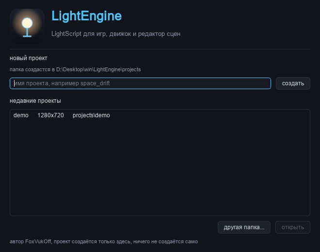
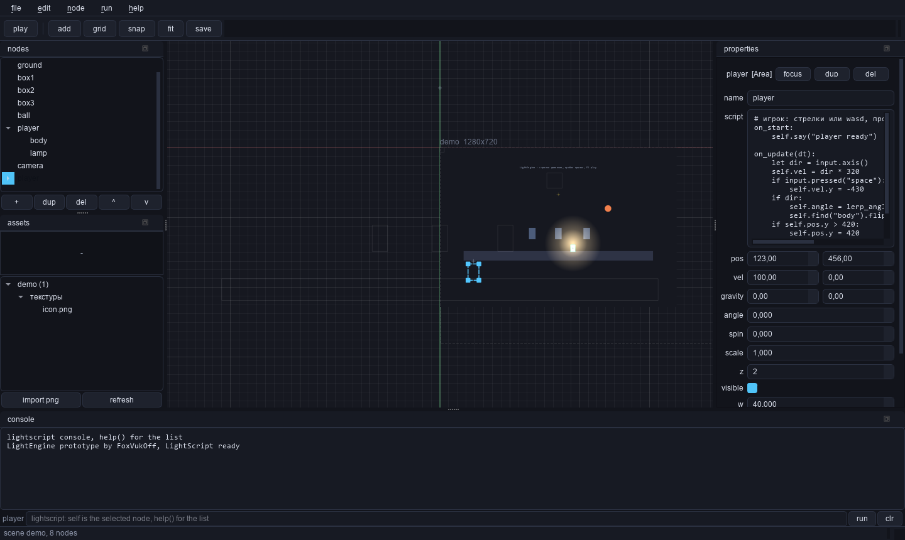
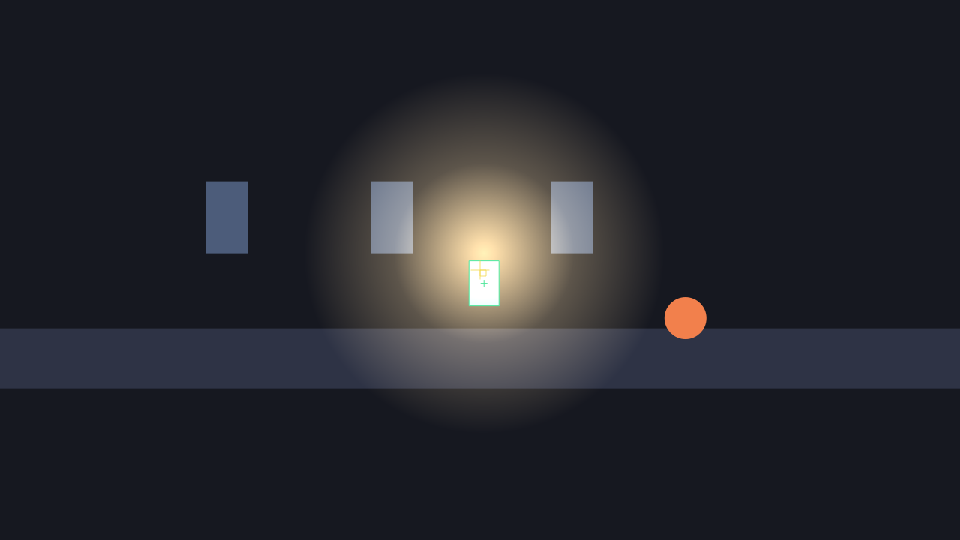

# LightEngine

2д игровой движок на python и PyQt6 со своим скриптовым языком LightScript.
Внутри редактор сцен: канвас, дерево узлов, инспектор, панель ассетов, консоль языка,
play прямо в редакторе и сборка игры в отдельный exe.

автор: **FoxVukOff**





## возможности

- язык LightScript: python-подобный синтаксис, события узлов, векторы, цвета, таймеры
- узлы: `Sprite`, `Rect`, `Circle`, `Label`, `Area`, `Camera2D`, `Light2D`, `Node2D`
- сцены в json, версии хранятся коммитами git
- проекты в `projects`, у каждого свои `assets`, `scenes` и `dist`
- play в редакторе, тест в отдельном окне, экспорт игры в exe
- консоль LightScript прямо в редакторе, `help()` показывает список языка
- тёмная тема, ошибки скриптов не роняют редактор, всё пишется в `logs/error.log`

## быстрый старт

```bat
pip install -r requirements.txt
python main.py
```

при первом запуске появляется окно приветствия. в нём вводится имя проекта и жмётся
`создать`, папка создаётся в `projects` рядом с движком: `projects/<имя>/`.
ничего само не создаётся, демо-проект для примера лежит в `projects/demo`.
в следующий раз движок откроет последний проект сам, поменять можно через
`file -> open project`.

скрипты лежат в `examples`, их можно копировать в поле script у любого узла.

## управление редактором

| клавиши | действие |
| --- | --- |
| `F5` | play |
| `F6` | stop |
| `ctrl+s` | сохранить сцену |
| `ctrl+o` | открыть сцену |
| `ctrl+shift+n` | новый проект |
| `ctrl+shift+o` | окно проектов |
| `ctrl+b` | собрать игру в exe |
| `ctrl+d` | дублировать узел |
| `ctrl+shift+f` | вписать сцену в экран |
| `del` | удалить узел |
| `f` | навести камеру на выбранный узел |
| стрелки | сдвиг на грид, с `shift` на пиксель |
| колесо | зум |
| `space` и мышь | панорамирование |
| правая кнопка | меню узла, добавить, дублировать, удалить, z |

## сборка exe

движок:

```bat
build\build_exe.bat
build\build_exe.bat --onedir
build\build_exe.bat --console
```

игра из проекта:

```bat
build\build_game.bat путь_к_проекту имя_игры
python build\build_game.py projects/demo --name mygame --console
```

в редакторе то же самое делает `file -> build game exe` или `ctrl+b`.
результат лежит в `dist` проекта, для движка в `build\dist`.
нужен `pip install pyinstaller`.

## структура проекта

```text
projects/<имя>/
  project.json     имя, входная сцена, размер окна, цвет фона
  scenes/          сцены .lscene, json в читаемом виде
  assets/          текстуры png jpg bmp svg и звуки wav ogg mp3
  scripts/         заметки и куски скриптов
  dist/            собранные exe игр
  logs/            error.log с крашами, если что-то пошло не так
```

## структура репозитория

```text
engine/     mathx node scene game graphics resources input project serialize gameapp
lscript/    lexer parser runtime builtins
editor/     mainwindow canvas hierarchy inspector console assets welcome theme projects
build/      build_exe.py build_game.py pack.py
projects/   demo проект как пример, остальные создаются из редактора
tests/      run_tests.py run_editor_test.py
tools/      make_demo.py make_icon.py shot.py shot_welcome.py selftest_game.py
```

## язык

полный справочник в [docs/lightscript.md](docs/lightscript.md), короткий пример:

```lightscript
on_update(dt):
    let dir = input.axis()
    self.vel = dir * 320
    if input.pressed("space"):
        self.vel.y = -430
    if dir:
        self.angle = lerp_angle(self.angle, dir.angle(), 0.25)
        self.find("body").flip_x = dir.x < 0
```

сцена в play, свет от `Light2D` и зона ввода у `Area`:



## тесты

```bat
python tests\run_tests.py
python tests\run_editor_test.py
```

`LE_SELFTEST=1` грузит сцену, гоняет кадры и рисует в offscreen, потом выходит с кодом 0.
так проверяется и движок из исходников, и собранный exe:

```bat
set LE_SELFTEST=1 && python main.py --project projects/demo
set LE_SELFTEST=1 && dist\mygame.exe
```

## требования

- python 3.11 и новее
- PyQt6
- pyinstaller, только для сборки exe

## лицензия

MIT, автор FoxVukOff, файл [LICENSE](LICENSE).
